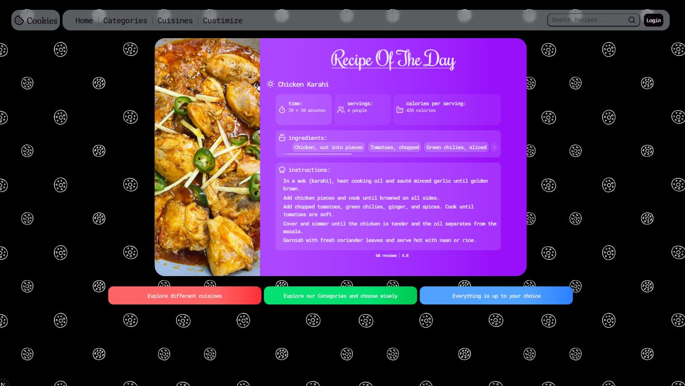

# 🍪 Recipe Page (Learning Project)

This is a **work-in-progress learning project** where I’m experimenting with building a recipe page using **Next.js** and **Tailwind CSS**.  
I switched from using TheMealDB API to a **dummy JSON source** so I can focus more on the layout, styling, and experimenting with UI ideas without worrying about data fetching issues.

---

## 📸 Preview

Here’s what the project currently looks like:

## 📝 Status

-   ❌ Not completed yet.
-   🛠️ I’m **actively working on it** and making changes as I go.
-   🎨 Main focus right now: layout, styling, and experimenting with Tailwind utilities.

---

## 🛠️ Tech Stack

-   [Next.js](https://nextjs.org/) – for the React framework & routing.
-   [Tailwind CSS](https://tailwindcss.com/) – for utility-first styling.
-   Dummy JSON – placeholder data for recipes.

---

## 🚀 Live Demo

Deployed with Vercel:  
👉 [Recipe Page on Vercel](https://cookies-recipe.vercel.app/)
